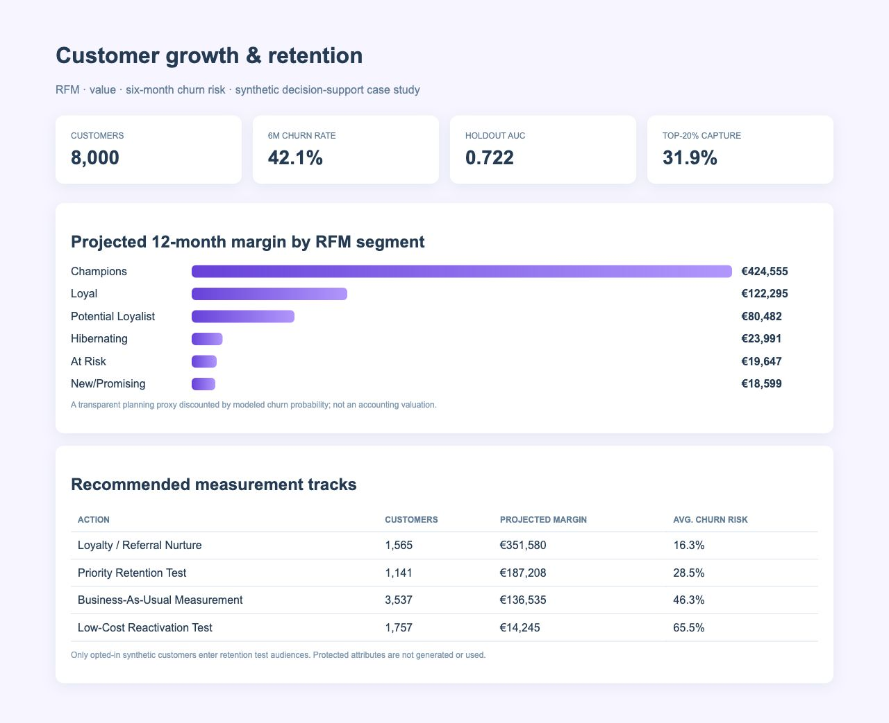
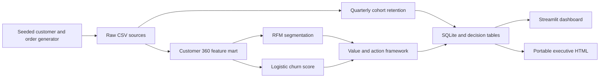

# Customer Growth Analytics: Segmentation, Value & Retention

An end-to-end marketing analytics project that connects cohort behavior, RFM segments, customer economics, and a transparent churn-risk model to an **experiment-ready retention audience**.

> Portfolio project: every customer, order, prediction, and euro amount is synthetic. Scores prioritize analysis and testing; they do not prescribe treatment.



## Executive snapshot

| Decision metric | Reproducible result |
|---|---:|
| Customers | 8,000 |
| Orders | 60,564 |
| Six-month observed churn | 42.2% |
| Logistic model test AUC | 0.722 |
| Churn captured in top 20% of test scores | 31.9% |
| Opted-in priority retention audience | 1,141 |
| Risk-adjusted projected 12-month margin | €689,568 |

The project avoids the common “send a discount to everyone predicted to churn” shortcut. It combines value at risk, consent, and model score to identify a measurable test population, while separating model performance from campaign impact.

## Business questions

1. Which customer groups create durable value and which show retention risk?
2. How do acquisition channels compare on CAC, margin, and six-month churn?
3. Can a simple, inspectable model prioritize churn risk better than random selection?
4. How should the team translate scores into an ethical retention experiment?

## What is inside

- **Customer 360 mart:** acquisition, consent, order behavior, returns, margin, RFM scores, outcomes, and model scores.
- **Growth analytics:** quarterly cohorts, RFM segmentation, acquisition quality, annual margin run rate, risk-adjusted value, and CLV:CAC proxy.
- **Transparent modeling:** NumPy logistic regression, deterministic train/test split, holdout AUC, top-20% capture and precision, and standardized coefficients.
- **Activation controls:** value-at-risk prioritization, opt-in filtering, recommended measurement tracks, and no protected attributes.
- **Delivery:** SQLite views, reusable Python, interactive Streamlit dashboard, portable HTML view, automated tests, and CI.

## Architecture



## Reproduce it

```bash
python3 -m venv .venv
source .venv/bin/activate
pip install -r requirements.txt
make all
make dashboard
```

Open `outputs/executive_dashboard.html` for a portable view. `make all` recreates the synthetic sources, customer mart, SQLite database, decision tables, model metrics, and tests.

## Repository map

```text
app/dashboard.py                    interactive growth dashboard
data/raw/                           synthetic customer and order sources
data/processed/customer_360.csv     feature, segment, score, value, action mart
data/processed/customer_growth.db   SQLite analytical mart
data/processed/retention_test_audience.csv
docs/                               business, data, model, and governance notes
notion/case-study.md                publish-ready case-study narrative
outputs/                            executive HTML and model metrics
sql/                                reusable decision views and questions
src/                                generator, analytics, and pipeline
tests/                              data/model/decision checks
```

## Model interpretation

The model predicts whether a customer places **no order during the next six months**, using only behavior available at the observation cutoff. AUC 0.722 indicates useful ranking—not certainty. The highest-scored 20% captures 31.9% of churners in the held-out sample.

No demographic or protected attributes are generated. Consent is not a model feature and is used only as an activation gate. A production review would add calibration, temporal validation, subgroup performance, stability monitoring, privacy review, and human approval.

## Limitations

- Synthetic relationships make the workflow reproducible but cannot establish real commercial lift.
- “Projected margin” is an explainable planning proxy, not accounting CLV.
- Churn is defined as no purchase in six months; the right horizon depends on category cadence.
- A risk score does not estimate treatment effect. Retention impact must be measured with a randomized test.
- Cohort retention uses observed orders and should be paired with survival methods for censored recent cohorts.

## Skills demonstrated

`SQL` · `Python` · `pandas` · `NumPy` · `RFM segmentation` · `cohort analysis` · `CLV:CAC` · `logistic regression` · `model evaluation` · `CRM measurement` · `SQLite` · `Streamlit` · `testing` · `GitHub Actions`

Read [the model card](docs/model-card.md), [data dictionary](docs/data-dictionary.md), and [Notion case study](notion/case-study.md) for the interview-ready detail.
